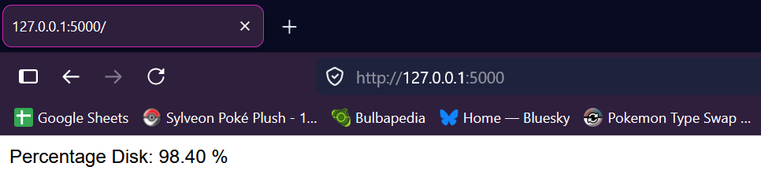
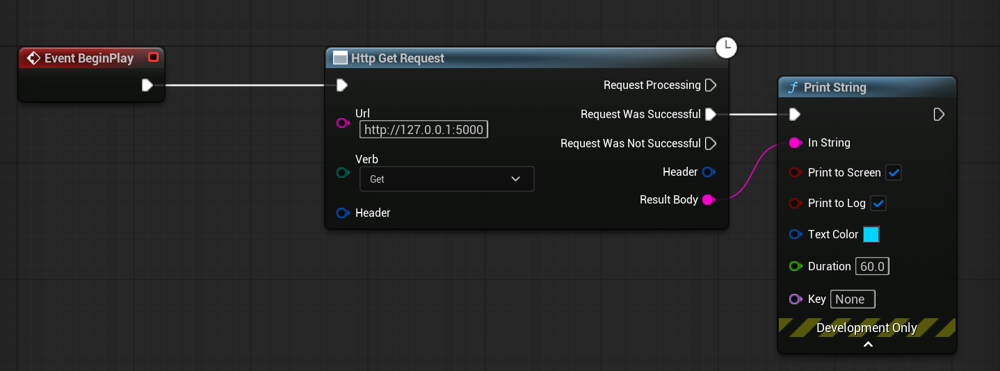
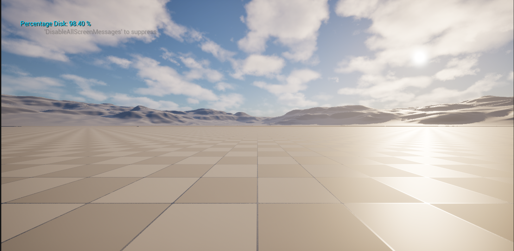

# Task Title

---

## 1. Introduction

I was tasked to create an online service, tool, or utility using a cloud service, or a locally hosted app, and demonstrate communication between it and an Unreal  Engine Project using an HTTP Request, Delegates, JSON, CSV, Data Table, or Data Asset. I chose to use Flask with Python to create a locally hosted website which detects and displays the specs of the computer that is running it, and then have Unreal make an HTTP Request to the website and Print it as a String. Communication between Unreal and online data can be useful in a technical setting as it can be used to have data saved in a server shown to the player in game, such as for leaderboards in online multiplayer games, especially MMOs.

---

## 2. Implementation

I utilised the language Python, along with Flask, a self-described 
"lightweight WSGI web application framework" to collect the specs of my computer, and write the Percentage of Disk Space in use. I followed the basic Flask documentation as well as a separate tutorial I found in order to collect the system info using the psutil library in Python.

To begin with I imported the required prerequisites.
```
from flask import Flask, request
import psutil
import platform
from datetime import datetime, time
```

I then inputted code to get the disk partitions and define the partition usage.
```
partitions = psutil.disk_partitions()
for partition in partitions:
    try:
        partition_usage = psutil.disk_usage(partition.mountpoint)
    except PermissionError: 
        continue
```

I then had the app return the partition usage as a percentage, displaying it in the webpage. I also had it run with debug
```
@app.route("/", methods=["GET"])
def data():
    return (f"Percentage Disk: {partition_usage.percent:.2f} %")

if __name__ == "__main__":
    app.run(debug=True)
```
As I did not specify a port, 5000 is the standard, so visiting the local webpage 127.0.0.1:5000 causes it to display my computer's disk space usage as a percentage.

*Figure 1: A screenshot of a local website with used disk space as a percentage displayed.*


From there I then opened a new Unreal Project, and created a basic Actor Class, I then connected the BeginPlay Node to an Http Get Request Node, and inputted the URL "127.0.0.1:5000", before then connecting that Node to a Print String Node, the string should then print the Disk Space Percentage In Use.

*Figure 2: A screenshot of Unreal Engine displaying blueprints which get an HTML request from a local website and Printing the result as a string.*


When the Actor is placed in the scene and the play button is pressed, the string correctly displays the text.

---

## 3. Outcome 

The final result collects the data from a locally hosted website that uses Python to collect my computer's used disk space as a percentage and lists it inside of Unreal. This completes the requirements of the task, as I have used an HTTP Request to collect data from a locally hosted website that I created, and Unreal Engine displays the collected data from this website as a string when the level begins.

*Figure 3: A screenshot of Unreal Engine displaying a Print Screen that shows my computer's used Disk Space as a percentage.*



---

## 4. Bibliography

Welcome to Flask — Flask Documentation (3.1.x) (s.d.) At: https://flask.palletsprojects.com/en/stable/ (Accessed  22/04/2026).  

Simple HTTP GET request within a Blueprint - Unreal Engine 5 Tutorial (2023) Directed by Geert Verhoeff - Tutorials. At: https://www.youtube.com/watch?v=Ln1Dk2pF2Bg (Accessed  21/04/2026).  

Fadheli, A. (s.d.) How to Get Hardware and System Information in Python - The Python Code. At: https://thepythoncode.com/article/get-hardware-system-information-python (Accessed  21/04/2026).  

---

## 5. AI Usage Declaration

Copilot was used for the purposes of IntelliSense to assist with coding.

---
